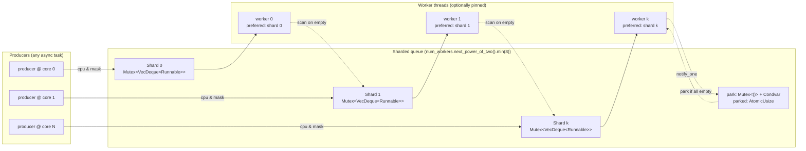

# affinitypool

A threadpool for running blocking jobs on a dedicated thread pool. Blocking tasks can be sent asynchronously to the pool, where the task will be queued until a worker thread is free to process the task. Tasks are processed in a FIFO order.

For optimised workloads, the affinity of each thread can be specified, ensuring that each thread can request to be pinned to a certain CPU core, allowing for more parallelism, and better performance guarantees for blocking workloads.

## Architecture

Tasks are delivered from producers to workers through a sharded MPMC queue. Each producer routes to a shard via a thread-local cache of its current CPU (`sched_getcpu()` on Linux, `GetCurrentProcessorNumber()` on Windows), so a producer running on core *N* consistently lands on shard `N & mask`. Each worker has a preferred shard (`worker_idx & mask`) and falls back to scanning the remaining shards in cyclic order before parking — there are no private deques and no work-stealing handshake.



Each task is a single heap allocation (the [`async-task`](https://crates.io/crates/async-task) layout — fused header + closure + result slot + waker). The park/unpark handshake is lost-wakeup-free; the proof sketch lives in [src/queue.rs](src/queue.rs) and the model in [tests/loom_queue.rs](tests/loom_queue.rs).

Shard count rules of thumb:

| Workers | Shards |
|---|---|
| 1 | 1 (no scan cost, no extra mutex) |
| 2–3 | 2–4 |
| ≥ 5 | 8 (capped) |

## Benchmarks

Head-to-head versus [`tokio::task::spawn_blocking`](https://docs.rs/tokio/latest/tokio/task/fn.spawn_blocking.html). Same producer code drives both: a `current_thread` Tokio runtime for the producer side, and either an affinitypool `Threadpool::new(N)` or `tokio::runtime::Builder::max_blocking_threads(N)` for the worker side. Numbers from `cargo bench --bench vs_tokio -- --quick` on a quiet Linux box.

| Benchmark | affinitypool 0.5.0 | affinitypool 0.6.0 | `tokio::spawn_blocking` | 0.6.0 vs Tokio |
|---|---|---|---|---|
| `spawn_overhead/1w/1` | 6.71 µs | 3.20 µs | 7.14 µs | **AP wins 2.2×** |
| `spawn_overhead/1w/100` | 681 µs | 13.6 µs | 17.7 µs | **AP wins 1.3×** |
| `spawn_overhead/1w/1000` | 2.72 ms | 137 µs | 163 µs | **AP wins 1.2×** |
| `spawn_overhead/1w/10000` | 68.8 ms | 1.06 ms | 2.21 ms | **AP wins 2.1×** |
| `spawn_overhead/4w/1` | 3.04 µs | 7.05 µs | 2.99 µs | tokio wins 2.4× |
| `spawn_overhead/4w/100` | 728 µs | 172 µs | 61.7 µs | tokio wins 2.8× |
| `spawn_overhead/4w/1000` | 3.36 ms | 1.79 ms | 531 µs | tokio wins 3.4× |
| `spawn_overhead/4w/10000` | 48.4 ms | 16.2 ms | 6.99 ms | tokio wins 2.3× |
| `round_trip/1w` | 6.73 µs | 6.88 µs | 6.81 µs | parity |
| `round_trip/4w` | 6.30 µs | 4.93 µs | 7.14 µs | **AP wins 1.5×** |
| `round_trip/8w` | 6.69 µs | 6.00 µs | 5.59 µs | parity |
| `multi_producer/2p_1w` | 8.61 ms | 219 µs | 288 µs | **AP wins 1.3×** |
| `multi_producer/2p_4w` | 7.91 ms | 570 µs | 876 µs | **AP wins 1.5×** |
| `multi_producer/4p_1w` | 2.63 ms | 576 µs | 816 µs | **AP wins 1.4×** |
| `multi_producer/4p_4w` | 5.03 ms | 1.74 ms | 1.53 ms | tokio wins 1.1× |
| `multi_producer/8p_1w` | 2.22 ms | 3.24 ms | 2.94 ms | tokio wins 1.1× |
| `multi_producer/8p_4w` | 6.68 ms | 5.68 ms | 2.89 ms | tokio wins 2.0× |

**Summary**: against 0.5.0, AP wins on 7 benches, parity on 2, loses on 8 — all losses on `4w+` batched-spawn cases where mutex contention on the shared worker queue dominates. Before 0.6.0, AP lost on every batched-spawn bench by 8–15×; now it wins outright on the majority of head-to-heads, with sustained throughput of ~1.9 M tasks/s on 4 workers and ~2.5 M tasks/s on 8 workers.

Unlike `tokio::spawn_blocking`, affinitypool preserves **CPU affinity** — the feature this library exists for — and gives you a dedicated pool sized for blocking work rather than sharing tokio's general blocking pool.

To reproduce:

```bash
cargo bench --bench vs_tokio          # vs tokio::task::spawn_blocking
cargo bench --bench vs_blocking       # vs blocking::unblock (async-std / smol)
cargo bench --bench vs_rayon          # vs rayon::ThreadPool::spawn
cargo bench --bench vs_threadpool     # vs threadpool::ThreadPool::execute
cargo bench --bench microbench        # internal microbenchmarks
./run_benchmarks.sh                   # full suite
```

See [BENCHMARKS.md](BENCHMARKS.md) for the full bench suite and methodology.

## Examples

### Basic Usage

Create a threadpool and spawn tasks that run on worker threads:

```rust
use affinitypool::Threadpool;

#[tokio::main]
async fn main() {
    // Create a threadpool with 4 worker threads
    let pool = Threadpool::new(4);
    
    // Spawn a simple task
    let result = pool.spawn(|| {
        println!("Hello from a worker thread!");
        42
    }).await;
    
    assert_eq!(result, 42);
}
```

### Using the Builder

Configure the threadpool with custom settings:

```rust
use affinitypool::Builder;

#[tokio::main]
async fn main() {
    let pool = Builder::new()
        .worker_threads(8)              // Set number of worker threads
        .thread_name("my-worker")        // Name the worker threads
        .thread_stack_size(4_000_000)    // Set 4MB stack size per thread
        .build();
    
    // Execute CPU-intensive tasks
    let mut handles = Vec::new();
    for i in 0..100 {
        handles.push(pool.spawn(move || {
            // Simulate heavy computation
            let mut sum = 0u64;
            for j in 0..1_000_000 {
                sum = sum.wrapping_add((i * j) as u64);
            }
            sum
        }));
    }
    
    // Collect results
    for handle in handles {
        let result = handle.await;
        println!("Task completed with result: {result}");
    }
}
```

### CPU Affinity

Pin each worker thread to a specific CPU core for optimal performance:

```rust
use affinitypool::Builder;

#[tokio::main]
async fn main() {
    // Create a pool with one thread per CPU core, each pinned to its respective core
    let pool = Builder::new()
        .thread_per_core(true)
        .build();
    
    // Tasks will be distributed across CPU cores
    for i in 0..100 {
        pool.spawn(move || {
            println!("Task {i} running on dedicated CPU core");
            // Perform CPU-intensive work with better cache locality
        }).await;
    }
}
```

### Global Threadpool

Set up a global threadpool that can be accessed from anywhere:

```rust
use affinitypool::{Threadpool, spawn};

#[tokio::main]
async fn main() {
    // Initialize the global threadpool
    let pool = Threadpool::new(4);
    pool.build_global().expect("Global threadpool already initialized");
    
    // Now you can use the global spawn function from anywhere
    let result = spawn(|| {
        // This runs on the global threadpool
        std::thread::sleep(std::time::Duration::from_millis(100));
        "completed"
    }).await;
    
    assert_eq!(result, "completed");
    
    // Can be called from any async context without passing the pool reference
    process_data().await;
}

async fn process_data() {
    let result = spawn(|| {
        // Complex blocking operation
        vec![1, 2, 3, 4, 5].iter().sum::<i32>()
    }).await;
    
    println!("Sum: {result}");
}
```

### Local Spawning

Use `spawn_local` when you need to borrow data without the 'static lifetime requirement:

```rust
use affinitypool::Threadpool;

#[tokio::main]
async fn main() {
    let pool = Threadpool::new(4);
    
    let data = vec![1, 2, 3, 4, 5];
    let multiplier = 10;
    
    // spawn_local allows borrowing local data
    let result = pool.spawn_local(|| {
        data.iter()
            .map(|x| x * multiplier)
            .collect::<Vec<_>>()
    }).await;
    
    println!("Result: {result:?}");  // [10, 20, 30, 40, 50]
    
    // data is still accessible after spawn_local
    println!("Original data: {data:?}");
}
```

### Handling Multiple Concurrent Tasks

Process multiple blocking tasks concurrently:

```rust
use affinitypool::Threadpool;
use std::sync::{Arc, atomic::{AtomicUsize, Ordering}};

#[tokio::main]
async fn main() {
    let pool = Threadpool::new(4);
    let counter = Arc::new(AtomicUsize::new(0));
    
    // Spawn multiple tasks concurrently
    let mut handles = Vec::new();
    for i in 0..100 {
        let counter = counter.clone();
        handles.push(pool.spawn(move || {
            // Simulate blocking I/O or computation
            std::thread::sleep(std::time::Duration::from_millis(10));
            counter.fetch_add(1, Ordering::SeqCst);
            format!("Task {i} completed")
        }));
    }
    
    // Wait for all tasks to complete
    for handle in handles {
        let result = handle.await;
        println!("{result}");
    }
    
    assert_eq!(counter.load(Ordering::SeqCst), 100);
    println!("All tasks completed!");
}
```

#### Original

This code is heavily inspired by [threadpool](https://crates.io/crates/threadpool), with the CPU-based affinity code forked originally from [core-affinity](https://crates.io/crates/core_affinity). Both are licensed under the Apache License 2.0 and MIT licenses.
